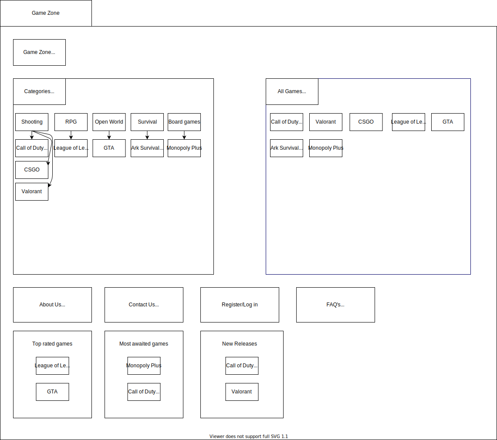
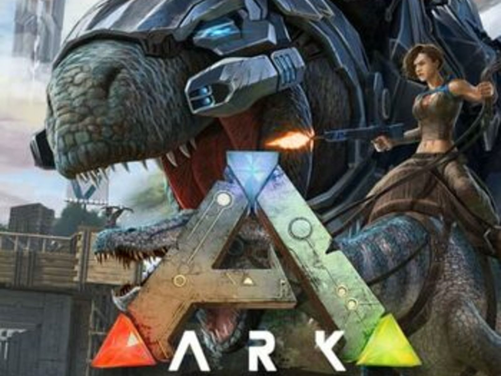
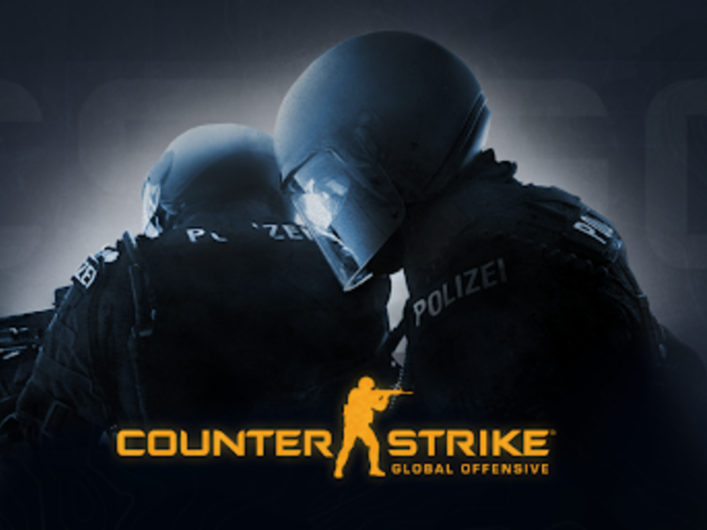
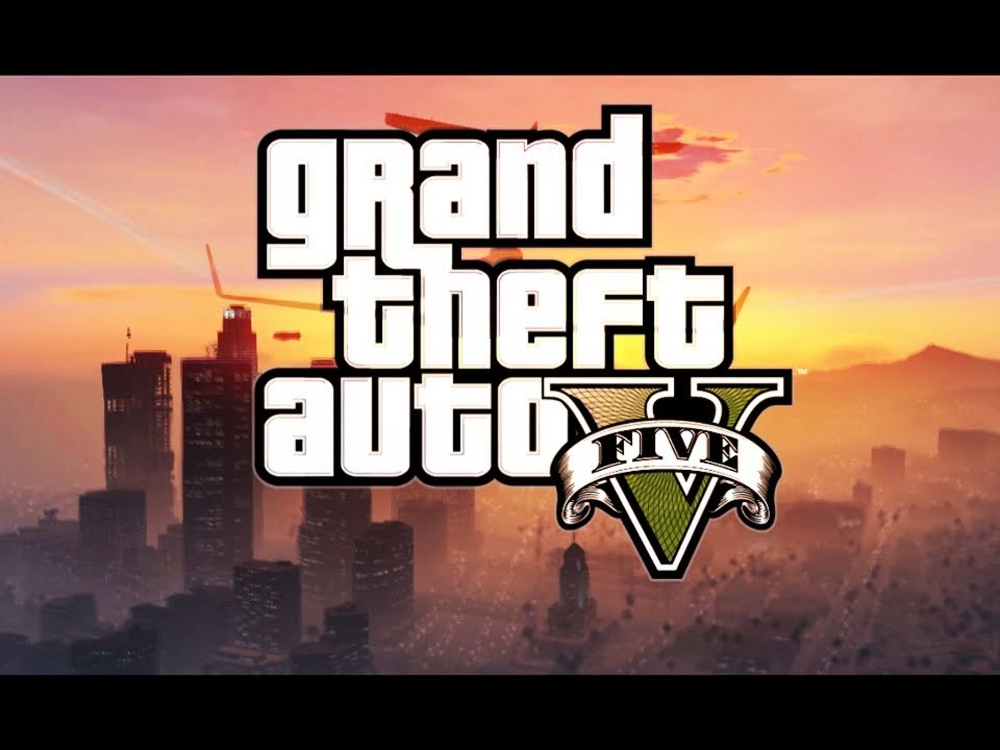
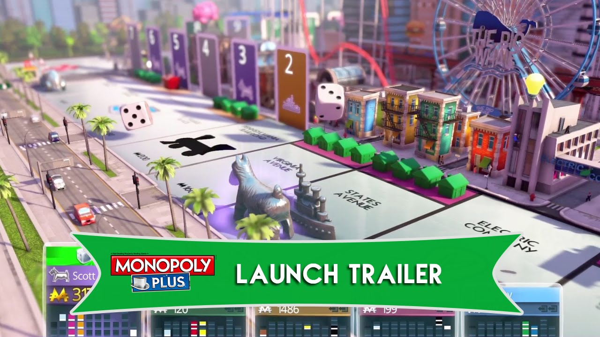
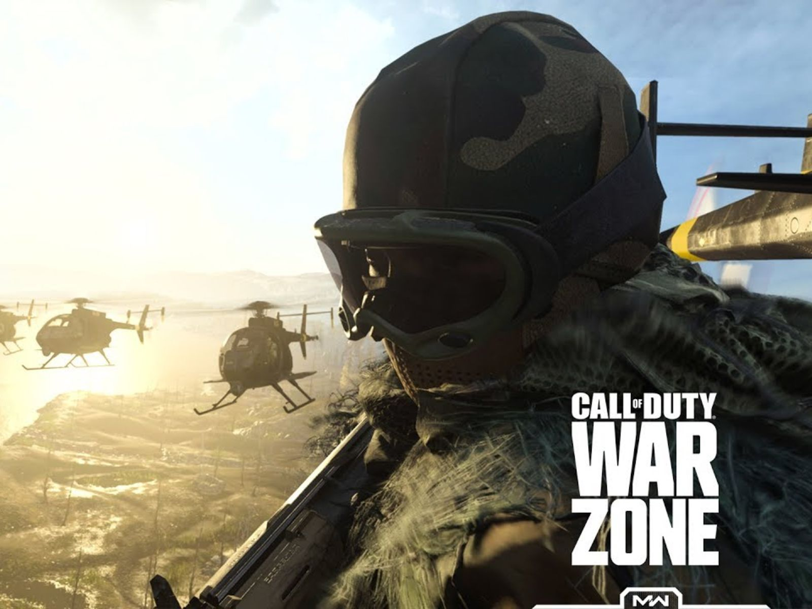

# GameZone
*Developer Work Distribution*
Developer: Albrecht (Albrenik), Shrestha (shresdee)

Design of Prototype: Shrestha
Creation of Prototype: Shrestha
Creation of Logo: Shrestha
Top rated games page: Albrecht
Most awaited Games: Albrecht
New Releases Page: Albrecht
All Games Page: Albrecht
Main Page(Categoeries): Shrestha
About Us Page: Shrestha
Contact Us Page: Shrestha
Register Page: Shrestha
FAQ's Page: Albrecht

**Business Description**  
Our goal is to provide our users with the most up to date informations about games,
game requirements and everything you will need to know to jump right into
the game.  
You don't know what game to play, check our wide varieties of game reviews.  
You don't know if your PC can run this game, check our recommended hardware specs for this game.   
You don't know how to play the game, check our wide varieties on quick tutorials and game plays.  
Check the most top rated games for this year, and the best games for each genre.  
If you want to buy a game with the lowest price, we can provide several links with the best price out there.  
for more information check our website and enjoy a lot of what we have to offer.

**Website title, domain and purpose**  
**Website title**: Gamezone  
**Domain**: https://gamezone.ninja/  
**Purpose**: Since we have an interest in video games, and how they are designed. We decided to come up with a website to
help the visitors collect as much information as they can about specific games, and that's why we named our website GameZone.

**Webpages**  
**Home**: Home contains new releases, most awaited games, top rated games with option to directly land into
the respective pages showing 2 to 3 games for each page as highlight. It should also be possible to 
navigate to the following pages categories, all games, about us, contact us, FAQ's and registration.  
**new releases, most awaited games, top rated games**: Each page should contain games with their 
images that can be then clicked to navigate to the page for that game.  
**Game page**: Game page will include the reviews, ratings, official trailer, gameplays, 
hardware requirements and at least one link to buy (if free then to download) that game.  
**Categories**: Contains the categories of the games and each category can be clicked to land to its page
for e.g rpg.  
**Category**: Contains the games belonging to that particular category.  
**All games**: Every game included in the assignment should be listed here and sorted Alphabetically.  
**about us**: Information about the company and its goals.  
**contact us**: A simple formular where you can write your name, email address and a text with max 100 
words which will then be sent to the company.  
**FAQ's**: Most asked questions will be answered here.  
**Registration**: Option to create an account and register for newsletter.

**Web Design Diagram** 

**Requirements**  
**XML Data file**: List of all games with their year of release, ratings, reviews, publisher, developers, 
category and a small description of the game.  
**SVG**: The logo of the company is to be designed in SVG.  
**Video**: Trailers and gameplays for each game are to be added on the website.  

**webpage names and content**  
**Please consider the following file Conventions and Contents**.  
**Homepage**  
starting from the Homepage you should consider naming the file index.html and set the title as Homepage.  
This file should contain the following items:  
1) Categories page that contain all the categories given in the web design diagram  
2) All Games web page  
3) Top rated games  
4) Most awaited games  
5) new Releases  
6) About us  
7) Contact us  
8) Register  
9) FAQ's    

**Categories**  
Please consider naming this file as categories.html and the title should be set as Categories.  
This webpage should contain all the categories in the diagram which are set in an alphabetical order.  
Each category should contain at least one game of this genre.  
**All Games**  
Please consider naming this file allGames.html and the title should be set as All Games.  
This webpage should contain the games in an alphabetical order, and each game should be provided with a picture.  
**About us**  
Please consider naming this file as aboutUs.html and the title should be set as About us.  
should contain a brief introduction to our company, and what it has to offer its visitors.  
**Contact us**  
Please consider naming this file as contactUs.html and the title should be set as Contact Us.  
should contain all the contacting infos, via E-mail and social media.  
**Register**  
Please consider naming this file as registeringInfos.html and the title as Register  
Visitors should be able to register to our website and subscribe to our newsletter 
**FAQ's**  
Please consider naming this file as faqs.html and the title as FAQ's.  
Visitors of our website should be able to see which question were frequently asked (answers included).  
**Top rated games**  
Please consider naming this file as topRatedGames.html and the title as Top rated games.  
Visitors should always be able to check the best available games on the market.  
**Most awaited games**  
Please consider naming this file as mostAwaitedGames.html and the title as Most awaited games.  
Visitors should always be able to see which games are most awaited depending on the trailer's reviews.  
**New Releases**  
Please consider naming this file as newReleases.html and the title as new Releases.  
Visitors should be able to check the latest games released with their reviews.  
**Games**  
Please consider naming the file and the title of the game as the name of the game.  
All given games should have a picture, rating, a quick tutorial video, its price, hardware required specs, 
a gameplay video, and a description.

**Resources**  
**ark**:   
    
*Trailer*: https://youtu.be/iyvgDZL514A     

**csgo**:    
    
*Trailer*: https://youtu.be/edYCtaNueQY  

**gta**:    
    
*Trailer*: https://youtu.be/hvoD7ehZPcM  

**league of legends**:    
    
*Trailer*: https://youtu.be/7O21Z6vgtmY  

**monoply**:    
   
*Trailer*: https://youtu.be/nh-wOBN-TgE   

**volarant**:    
    
*Trailer*: https://youtu.be/lWr6dhTcu-E  

**warzone**:    
    
*Trailer*: https://youtu.be/0E44DClsX5Q  

**Basic Prototype of the Website**  
   
The Website should follow the given prototype in terms of colors, fonts and layout.

#### Developer Work Distribution
| Developer | Tasks |
| ----- | ----- |
| Shresta | Mokup, Logo, 4 webpages |
| Albrecht | 5 webpages |
